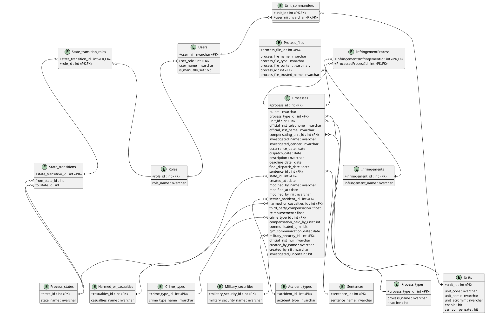

## Database Diagram

```plantuml
@startuml
skinparam classAttributeIconSize 0

' =======================
' Tables
' =======================

entity "Process_types" as ProcessTypes {
  + process_type_id : int <<PK>>
  --
  process_name : nvarchar
  deadline : int
}

entity "Accident_types" as AccidentTypes {
  + accident_id : int <<PK>>
  --
  accident_type : nvarchar
}

entity "Sentences" as Sentences {
  + sentence_id : int <<PK>>
  --
  sentence_name : nvarchar
}

entity "Process_states" as ProcessStates {
  + state_id : int <<PK>>
  --
  state_name : nvarchar
}

entity "Harmed_or_casualties" as HarmedOrCasualties {
  + casualties_id : int <<PK>>
  --
  casualties_name : nvarchar
}

entity "Crime_types" as CrimeTypes {
  + crime_type_id : int <<PK>>
  --
  crime_type_name : nvarchar
}

entity "Military_securities" as MilitarySecurities {
  + military_security_id : int <<PK>>
  --
  military_security_name : nvarchar
}

entity "State_transitions" as StateTransitions {
  + state_transition_id : int <<PK>>
  --
  from_state_id : int
  to_state_id : int
}

entity "State_transition_roles" as StateTransitionRoles {
  + state_transition_id : int <<PK,FK>>
  + role_id : int <<PK,FK>>
}

entity "Processes" as Processes {
  + process_id : int <<PK>>
  --
  nuipm : nvarchar
  process_type_id : int <<FK>>
  unit_id : int <<FK>>
  official_inst_telephone : nvarchar
  official_inst_name : nvarchar
  compensating_unit_id : int <<FK>>
  investigated_name : nvarchar
  investigated_gender : nvarchar
  occurrence_date : date
  dispatch_date : date
  description : nvarchar
  deadline_date : date
  final_dispatch_date : date
  sentence_id : int <<FK>>
  state_id : int <<FK>>
  created_at : date
  modified_by_name : nvarchar
  modified_at : date
  modified_by_nii : nvarchar
  service_accident_id : int <<FK>>
  harmed_or_casualties_id : int <<FK>>
  third_party_compensation : float
  reimbursement : float
  crime_type_id : int <<FK>>
  compensation_paid_by_unit : int
  communicated_pjm : bit
  pjm_communication_date : date
  military_security_id : int <<FK>>
  official_inst_nui : nvarchar
  created_by_name : nvarchar
  created_by_nii : nvarchar
  investigated_uncertain : bit
}

entity "Infringements" as Infringements {
  + infringement_id : int <<PK>>
  --
  infringement_name : nvarchar
}

entity "InfringementProcess" as InfringementProcess {
  + InfringementsInfringementId : int <<PK,FK>>
  + ProcessesProcessId : int <<PK,FK>>
}

entity "Process_files" as ProcessFiles {
  + process_file_id : int <<PK>>
  --
  process_file_name : nvarchar
  process_file_type : nvarchar
  process_file_content : varbinary
  process_id : int <<FK>>
  process_file_trusted_name : nvarchar
}

entity "Units" as Units {
  + unit_id : int <<PK>>
  --
  unit_code : nvarchar
  unit_name : nvarchar
  unit_acronym : nvarchar
  enable : bit
  can_compensate : bit
}

entity "Unit_commanders" as UnitCommanders {
  + unit_id : int <<PK,FK>>
  + user_nii : nvarchar <<PK,FK>>
}

entity "Users" as Users {
  + user_nii : nvarchar <<PK>>
  --
  user_role : int <<FK>>
  user_name : nvarchar
  is_manually_set : bit
}

entity "Roles" as Roles {
  + role_id : int <<PK>>
  --
  role_name : nvarchar
}

' =======================
' Relationships
' =======================

' Processes FKs
Processes::process_type_id }o--|| ProcessTypes::process_type_id
Processes::sentence_id }o--|| Sentences::sentence_id
Processes::state_id }o--|| ProcessStates::state_id
Processes::service_accident_id }o--|| AccidentTypes::accident_id
Processes::harmed_or_casualties_id }o--|| HarmedOrCasualties::casualties_id
Processes::crime_type_id }o--|| CrimeTypes::crime_type_id
Processes::military_security_id }o--|| MilitarySecurities::military_security_id

Processes::unit_id }o--|| Units::unit_id
Processes::compensating_unit_id }o--|| Units::unit_id

' Process files
ProcessFiles::process_id }o--|| Processes::process_id

' Infringements many-to-many
InfringementProcess::InfringementsInfringementId }o--|| Infringements::infringement_id
InfringementProcess::ProcessesProcessId }o--|| Processes::process_id

' State transitions
StateTransitions::from_state_id }o--|| ProcessStates::state_id
StateTransitions::to_state_id }o--|| ProcessStates::state_id

StateTransitionRoles::state_transition_id }o--|| StateTransitions::state_transition_id
StateTransitionRoles::role_id }o--|| Roles::role_id

' Units, users, roles
UnitCommanders::unit_id }o--|| Units::unit_id
UnitCommanders::user_nii }o--|| Users::user_nii

Users::user_role }o--|| Roles::role_id
@enduml
```