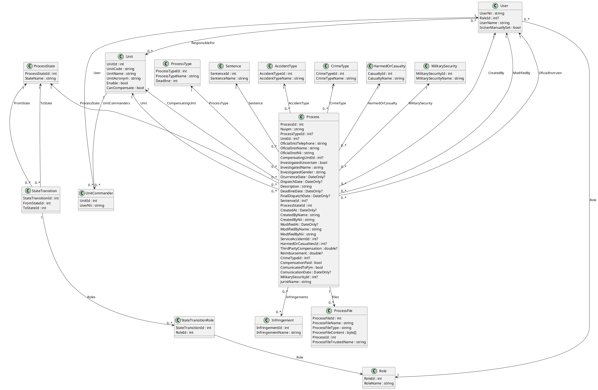

```plantuml
@startuml

' ============================
' PROCESS
' ============================

class Process {
  ProcessId : int
  Nuipm : string
  ProcessTypeId : int?
  UnitId : int?
  OficialInstTelephone : string
  OficialInstName : string
  OficialInstNii : string
  CompensatingUnitId : int?
  InvestigatedUncertain : bool
  InvestigatedName : string
  InvestigatedGender : string
  OcurrenceDate : DateOnly?
  DispatchDate : DateOnly?
  Description : string
  DeadlineDate : DateOnly?
  FinalDispatchDate : DateOnly?
  SentenceId : int?
  ProcessStateId : int
  CreatedAt : DateOnly?
  CreatedByName : string
  CreatedByNii : string
  ModifiedAt : DateOnly?
  ModifiedByName : string
  ModifiedByNii : string
  ServiceAccidentId : int?
  HarmedOrCasualtiesId : int?
  ThirdPartyCompensation : double?
  Reimbursement : double?
  CrimeTypeId : int?
  CompensationPaid : bool
  ComunicatedToPjm : bool
  ComunicationDate : DateOnly?
  MilitarySecurityId : int?
  JuristName : string
}

' ============================
' RELATED ENTITIES
' ============================

class ProcessType {
  ProcessTypeId : int
  ProcessTypeName : string
  Deadline : int
}

class ProcessState {
  ProcessStateId : int
  StateName : string
}

class Sentence {
  SentenceId : int
  SentenceName : string
}

class AccidentType {
  AccidentTypeId : int
  AccidentTypeName : string
}

class CrimeType {
  CrimeTypeId : int
  CrimeTypeName : string
}

class HarmedOrCasualty {
  CasualtyId : int
  CasualtyName : string
}

class MilitarySecurity {
  MilitarySecurityId : int
  MilitarySecurityName : string
}

class Infringement {
  InfringementId : int
  InfringementName : string
}

class ProcessFile {
  ProcessFileId : int
  ProcessFileName : string
  ProcessFileType : string
  ProcessFileContent : byte[]
  ProcessId : int
  ProcessFileTrustedName : string
}

class Unit {
  UnitId : int
  UnitCode : string
  UnitName : string
  UnitAcronym : string
  Enable : bool
  CanCompensate : bool
}

class UnitCommander {
  UnitId : int
  UserNii : string
}

class User {
  UserNii : string
  RoleId : int?
  UserName : string
  IsUserManuallySet : bool
}

class Role {
  RoleId : int
  RoleName : string
}

class StateTransition {
  StateTransitionId : int
  FromStateId : int
  ToStateId : int
}

class StateTransitionRole {
  StateTransitionId : int
  RoleId : int
}

' ============================
' RELATIONSHIPS
' ============================

' ============================
' PROCESS LOOKUPS (1 → N)
' ============================
ProcessType       "1" <-- "0..*" Process : ProcessType
ProcessState      "1" <-- "0..*" Process : ProcessState
Sentence          "1" <-- "0..*" Process : Sentence
AccidentType      "1" <-- "0..*" Process : AccidentType
HarmedOrCasualty  "1" <-- "0..*" Process : HarmedOrCasualty
CrimeType         "1" <-- "0..*" Process : CrimeType
MilitarySecurity  "1" <-- "0..*" Process : MilitarySecurity

' ============================
' PROCESS RELATIONSHIPS
' ============================
Process "0..*" --> "0..*" Infringement : Infringements
Process "1"    --> "0..*" ProcessFile  : Files

' ============================
' PROCESS ↔ UNIT (1 → N)
' ============================
Unit "1" <-- "0..*" Process : Unit
Unit "1" <-- "0..*" Process : CompensatingUnit

' ============================
' PROCESS ↔ USER (1 → N)
' ============================
User "1" <-- "0..*" Process : CreatedBy
User "1" <-- "0..*" Process : ModifiedBy
User "1" <-- "0..*" Process : OficialInstrutor

' ============================
' UNIT ↔ USER (TWO DIFFERENT RELATIONSHIPS)
' ============================
User "0..*" --> "0..*" Unit : ResponsibleFor

Unit "1" --> "0..*" UnitCommander : UnitCommanders
UnitCommander "0..*" --> "1" User : User

' ============================
' USER ↔ ROLE
' ============================
User "0..*" --> "1" Role : Role

' ============================
' STATE TRANSITIONS
' ============================
ProcessState "1" <-- "0..*" StateTransition : FromState
ProcessState "1" <-- "0..*" StateTransition : ToState

StateTransition "1" --> "0..*" StateTransitionRole : Roles
StateTransitionRole --> Role : Role

@enduml
```