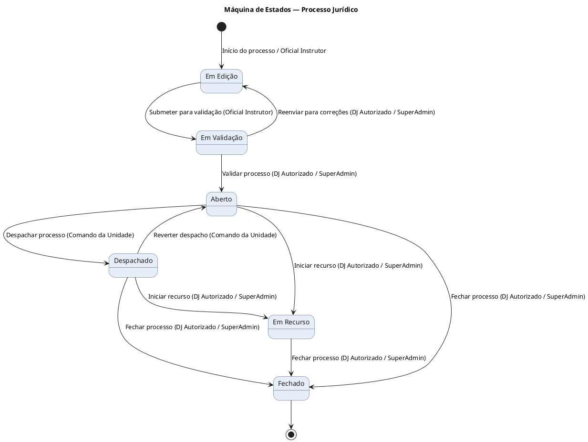

```plantuml
@startuml
skinparam state {
  BackgroundColor #e8eef7
  BorderColor #2b4c7e
  FontColor #1a1a1a
}

title Máquina de Estados — Processo Jurídico

state "Em Edição" as EmEdicao
state "Em Validação" as EmValidacao
state "Aberto" as Aberto
state "Despachado" as Despachado
state "Em Recurso" as EmRecurso
state "Fechado" as Fechado

[*] --> EmEdicao : Início do processo / Oficial Instrutor

' ============================
' Transitions
' ============================

EmEdicao --> EmValidacao : Submeter para validação (Oficial Instrutor)

EmValidacao --> Aberto : Validar processo (DJ Autorizado / SuperAdmin)
EmValidacao --> EmEdicao : Reenviar para correções (DJ Autorizado / SuperAdmin)

Aberto --> Despachado : Despachar processo (Comando da Unidade)
Despachado --> Aberto : Reverter despacho (Comando da Unidade)

Aberto --> Fechado : Fechar processo (DJ Autorizado / SuperAdmin)
Despachado --> Fechado : Fechar processo (DJ Autorizado / SuperAdmin)
EmRecurso --> Fechado : Fechar processo (DJ Autorizado / SuperAdmin)

Aberto --> EmRecurso : Iniciar recurso (DJ Autorizado / SuperAdmin)
Despachado --> EmRecurso : Iniciar recurso (DJ Autorizado / SuperAdmin)

Fechado --> [*]

@enduml
```