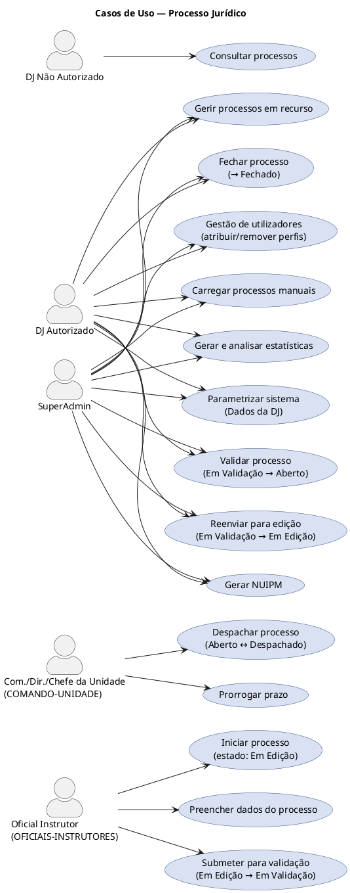

```plantuml
@startuml
left to right direction
skinparam actorStyle awesome
skinparam usecaseBorderColor #2b4c7e
skinparam usecaseBackgroundColor #d9e1f2

title Casos de Uso — Processo Jurídico

' ============================
' Atores
' ============================
actor "Oficial Instrutor\n(OFICIAIS-INSTRUTORES)" as OI
actor "Com./Dir./Chefe da Unidade\n(COMANDO-UNIDADE)" as CU
actor "DJ Autorizado" as DJA
actor "DJ Não Autorizado" as DJU
actor "SuperAdmin" as SA

' ============================
' Casos de Uso — Oficial Instrutor
' ============================
usecase "Iniciar processo\n(estado: Em Edição)" as UC_Iniciar
usecase "Preencher dados do processo" as UC_Preencher
usecase "Submeter para validação\n(Em Edição → Em Validação)" as UC_Submeter

' ============================
' Casos de Uso — Comando da Unidade
' ============================
usecase "Despachar processo\n(Aberto ↔ Despachado)" as UC_Despacho
usecase "Prorrogar prazo" as UC_Prorrogar

' ============================
' Casos de Uso — DJ Autorizado / SuperAdmin
' ============================
usecase "Validar processo\n(Em Validação → Aberto)" as UC_Validar
usecase "Reenviar para edição\n(Em Validação → Em Edição)" as UC_Reeditar
usecase "Gerar NUIPM" as UC_NUIPM
usecase "Gerir processos em recurso" as UC_Recurso
usecase "Fechar processo\n(→ Fechado)" as UC_Fechar
usecase "Gestão de utilizadores\n(atribuir/remover perfis)" as UC_GestaoUsers
usecase "Carregar processos manuais" as UC_Manual
usecase "Gerar e analisar estatísticas" as UC_Stats
usecase "Parametrizar sistema\n(Dados da DJ)" as UC_Param

' ============================
' Casos de Uso — DJ Não Autorizado
' ============================
usecase "Consultar processos" as UC_Consultar

' ============================
' Ligações
' ============================

' Oficial Instrutor
OI --> UC_Iniciar
OI --> UC_Preencher
OI --> UC_Submeter

' Comando da Unidade
CU --> UC_Despacho
CU --> UC_Prorrogar

' DJ Não Autorizado
DJU --> UC_Consultar

' DJ Autorizado
DJA --> UC_Validar
DJA --> UC_Reeditar
DJA --> UC_NUIPM
DJA --> UC_Recurso
DJA --> UC_Fechar
DJA --> UC_GestaoUsers
DJA --> UC_Manual
DJA --> UC_Stats
DJA --> UC_Param

' SuperAdmin (herda tudo do DJ Autorizado)
SA --> UC_Validar
SA --> UC_Reeditar
SA --> UC_NUIPM
SA --> UC_Recurso
SA --> UC_Fechar
SA --> UC_GestaoUsers
SA --> UC_Manual
SA --> UC_Stats
SA --> UC_Param

@enduml
```