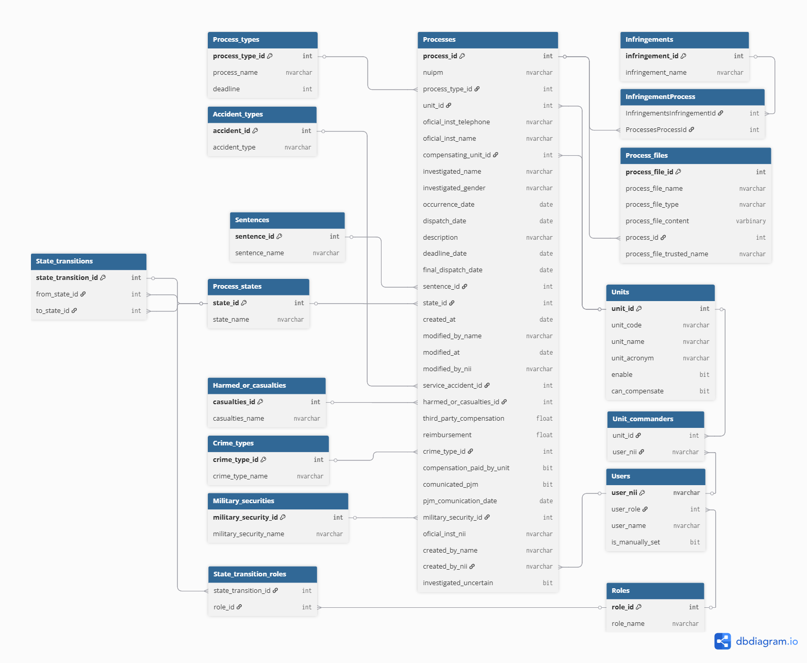

# 🗃️ Database Mapping

The system uses a **relational database model** in **Microsoft SQL Server**, mapped via **Entity Framework Core**, to manage legal and military processes.  
Below is a description of all the main tables and their purpose:

## 📐 Tables and Meaning

- **Process**  
  Represents the central legal or disciplinary case. Contains metadata, dates, involved parties, and foreign keys to related entities.

- **Process_files**  
  Stores attached files/documents for each process (file name and path).

- **Accident_types**  
  Lookup table for accident categories, used to classify occurrences.

- **Infringements**  
  Catalog of infringed legal articles. This table stores references to specific laws, codes, or regulations that were violated in each process.

- **InfringementProcess**  
  Junction table (many-to-many) linking processes with infringements.

- **Crime_types**  
  Lookup table for types of crimes associated with processes.

- **Process_types**  
  Defines the types of processes (disciplinary, Service Accidents, etc...) and their deadlines.

- **Military_securities**  
  Lookup table that categorizes security-related incidents involving military personnel.  

- **Roles**  
  Defines user roles and permissions (e.g., administrator, Oficial Instrutor, etc...).

- **Users**  
  System users, each linked to a specific role.

- **Unit_commanders**  
  Commanders responsible for each department.

- **Units**  
  Departments structure (code, name, etc...).

- **Harmed_or_casualties**  
  Records harmed parties, victims, or casualties related to the process.

- **Sentences**  
  Lookup table for types of sentences or final decisions applied to a process.

- **State_transition_roles**  
  Defines which roles are allowed to perform state transitions in a process.

- **State_transitions**  
  Possible transitions between process states (workflow).

- **Process_states**  
  Defines the possible states of a process (e.g., Em Edição, Em Validação, Aberto, etc...).

---

